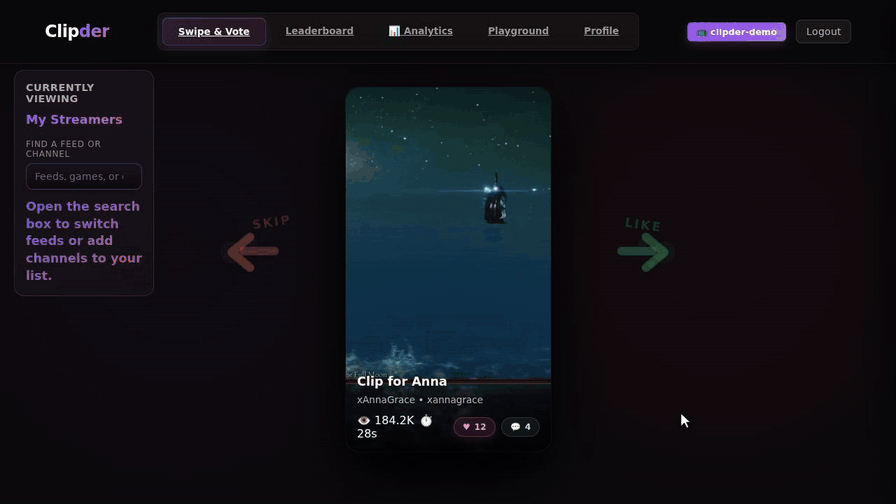

# Clipder

A Twitch clip discovery app. Browse clips from your favorite streamers, swipe
to vote, and collect the ones worth keeping. Saved clips land in the Playground,
where you can review them and prepare titles and descriptions for short-form
platforms.



Built with FastAPI and React.

## Requirements

- Python 3.12+ and [uv](https://docs.astral.sh/uv/getting-started/installation/)
- Node.js 22+
- PostgreSQL
- A [Twitch developer app](https://dev.twitch.tv/console/apps) for API credentials

## Setup

```bash
git clone https://github.com/Enizri/Clipder.git
cd Clipder
cp .env.example .env
```

Fill in `.env` — see the comments in [.env.example](.env.example) for what each
value does. At minimum you need a database URL, a JWT secret, and Twitch
credentials.

Install dependencies and create the tables:

```bash
uv sync --locked
uv run alembic upgrade head
cd frontend && npm ci && cd ..
```

## Running

Backend, from the project root:

```bash
uv run uvicorn main:app --reload --port 8000
```

Frontend, in a second terminal:

```bash
cd frontend
npm run dev
```

Open <http://localhost:3000>. The dev server proxies API and WebSocket requests
to the backend automatically.

To look around without signing in, open <http://localhost:3000/?demo=1> for the
walkthrough shown above.

## Development

```bash
uv run ruff check .
uv run pytest
```

Frontend checks run from `frontend/` with `npm run lint` and `npm run build`.

## License

MIT — see [LICENSE](LICENSE).
